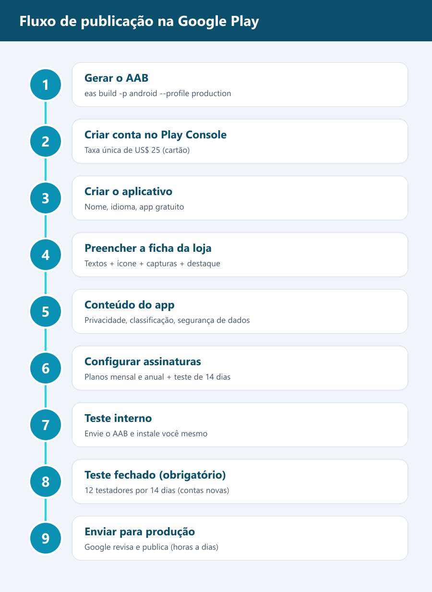
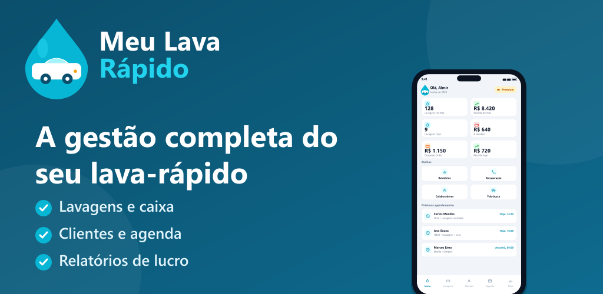
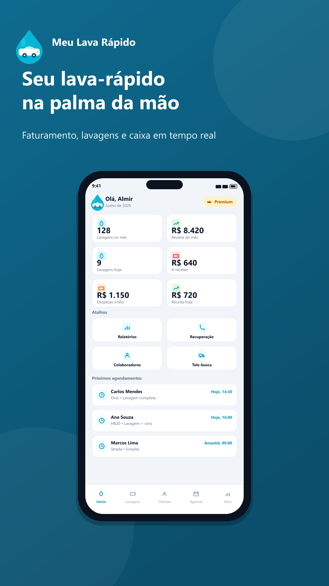
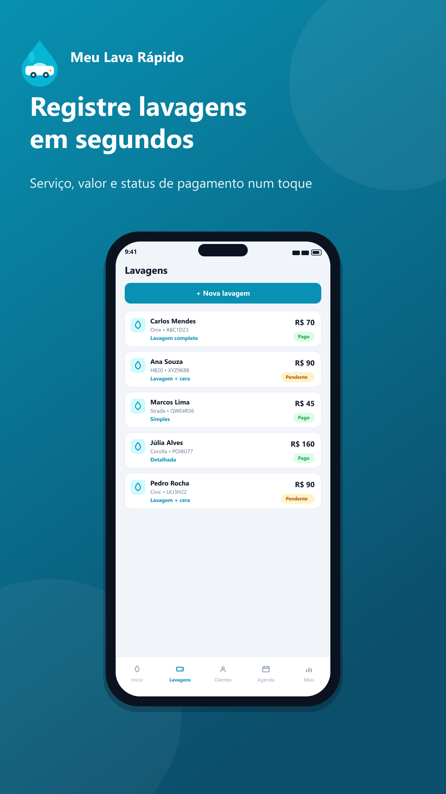

# Manual de Publicação na Google Play — Meu Lava Rápido

Guia passo a passo para enviar o **Meu Lava Rápido** para a Google Play Store.
Feito sob medida para este projeto (Expo + EAS). Siga na ordem.

> **Sobre as "imagens/prints":** o Google Play Console é uma área privada que exige o
> **seu login** e muda conforme a sua conta — por isso não é possível incluir prints da
> sua conta aqui. Em vez disso, cada passo descreve **exatamente a tela, o nome do botão
> e onde clicar** (os nomes batem com o Play Console atual em português). As imagens que
> você **vai enviar** para a loja já estão prontas na pasta `assets/` (ver Parte 5), e o
> fluxo geral está ilustrado abaixo.



---

## Índice
- [Pré-requisitos](#pré-requisitos)
- [Parte 0 — Ajustes técnicos ANTES de publicar (importante)](#parte-0--ajustes-técnicos-antes-de-publicar-importante)
- [Parte 1 — Gerar o arquivo do app (AAB) com EAS](#parte-1--gerar-o-arquivo-do-app-aab-com-eas)
- [Parte 2 — Criar a conta no Google Play Console](#parte-2--criar-a-conta-no-google-play-console)
- [Parte 3 — Criar o aplicativo no Console](#parte-3--criar-o-aplicativo-no-console)
- [Parte 4 — Configuração inicial do app (Painel)](#parte-4--configuração-inicial-do-app-painel)
- [Parte 5 — Ficha da loja (textos + imagens)](#parte-5--ficha-da-loja-textos--imagens)
- [Parte 6 — Conteúdo do app (privacidade, classificação, dados)](#parte-6--conteúdo-do-app-privacidade-classificação-dados)
- [Parte 7 — Assinaturas e compras no app](#parte-7--assinaturas-e-compras-no-app)
- [Parte 8 — Enviar a versão (teste interno)](#parte-8--enviar-a-versão-teste-interno)
- [Parte 9 — Teste fechado obrigatório (12 testadores / 14 dias)](#parte-9--teste-fechado-obrigatório-12-testadores--14-dias)
- [Parte 10 — Publicar em produção](#parte-10--publicar-em-produção)
- [Checklist final](#checklist-final)
- [Anexo — Especificação das imagens](#anexo--especificação-das-imagens)

---

## Pré-requisitos

| Item | Detalhe |
|---|---|
| Conta Google | Uma conta Google para o Play Console |
| Cartão de crédito | Taxa **única** de **US$ 25** para criar a conta de desenvolvedor |
| Node + EAS CLI | `npm install -g eas-cli` e estar logado: `eas login` |
| Conta Expo | Você já tem (`owner: almirseibert`, projectId configurado) |
| Imagens da loja | Já geradas na pasta `play-store/assets/` |
| Política de privacidade | Publicar `POLITICA_PRIVACIDADE.md` em uma URL pública |

Dados já configurados neste projeto (não precisa mudar):
- **Nome:** Meu Lava Rápido
- **Package / ID do app:** `com.makservicos.meulavarapido`
- **Versão:** `1.0.0`
- **Assinatura/versionCode:** gerenciados pelo EAS (`appVersionSource: remote`, `autoIncrement: true`)

---

## Parte 0 — Ajustes técnicos ANTES de publicar (importante)

⚠️ Revise estes pontos **antes** de gerar o build de produção. Eles evitam reprovação
e retrabalho.

### 0.1 Anúncios (AdMob) — decisão obrigatória
No `mobile/app.json`, o plugin `react-native-google-mobile-ads` está com os **IDs de
TESTE do Google** (`ca-app-pub-3940256099942544~...`) e há a permissão `AD_ID`.

Como o app agora usa **teste grátis + assinatura** (paywall), escolha **uma** opção:

- **Opção A — Não usar anúncios (recomendado para o modelo de assinatura):**
  remova o bloco do plugin `react-native-google-mobile-ads` e a permissão
  `com.google.android.gms.permission.AD_ID` do `app.json`. Assim, em "Segurança dos
  dados" e "Anúncios" você declara **que o app não tem anúncios** (mais simples).

- **Opção B — Manter anúncios:** substitua os IDs de teste pelos **IDs reais** da sua
  conta AdMob e, no Console, declare **"Contém anúncios" = Sim** e o uso do `AD_ID` na
  Segurança dos dados. Publicar com IDs de teste é proibido.

> Decida isso agora porque muda o `app.json` e, portanto, o build.

### 0.2 Assinaturas (RevenueCat / Google Play Billing)
O app usa `react-native-purchases`. Para as compras funcionarem em produção você
precisará, na Parte 7, **criar os produtos de assinatura** no Console (mensal R$ 49,90 e
anual R$ 499,90) e ligá-los ao RevenueCat. Os preços vêm da memória do projeto — confirme.

### 0.3 Confira nome, versão e ícone
- `app.json` → `expo.name`, `expo.version` (1.0.0) e `expo.android.package` corretos.
- Ícone do app: o arquivo `assets/icon.png` (1024×1024) é o que vira o ícone instalado.
  Para a **loja**, use o `play-store/assets/icon-512.png` (gerado para 512×512).

---

## Parte 1 — Gerar o arquivo do app (AAB) com EAS

A Google exige um **Android App Bundle (.aab)** para produção. O `eas.json` já está
configurado (`production` → `buildType: app-bundle`).

1. Abra o terminal na pasta `mobile`:
   ```bash
   cd mobile
   eas login            # se ainda não estiver logado
   ```
2. Gere o build de produção:
   ```bash
   eas build -p android --profile production
   ```
3. O EAS vai perguntar sobre a **assinatura do app**. Aceite deixar o **EAS gerenciar a
   keystore** (recomendado). Guarde bem essa keystore — ela identifica o app para sempre.
4. Aguarde o build na nuvem (alguns minutos). Ao final, o terminal mostra um link.
5. Baixe o arquivo **.aab** pela página do build (ou em https://expo.dev → seu projeto →
   Builds). É esse arquivo que você vai enviar na Parte 8.

> Dica: na **primeira** vez, você pode usar o perfil `preview` para gerar um **.apk** de
> teste rápido e instalar no celular (`eas build -p android --profile preview`). Para a
> loja, use sempre o `production` (.aab).

---

## Parte 2 — Criar a conta no Google Play Console

1. Acesse **https://play.google.com/console** e faça login com sua conta Google.
2. Clique em **Criar conta de desenvolvedor**. Escolha o tipo:
   - **Pessoal** (mais rápido) ou **Organização** (empresa/CNPJ — pede verificação extra).
3. Preencha nome do desenvolvedor (aparece na loja), endereço, telefone e e-mail.
4. Pague a **taxa única de US$ 25** no cartão.
5. Conclua a **verificação de identidade** que a Google solicitar (documento etc.).
   Pode levar de algumas horas a alguns dias para liberar.

> **Atenção (contas novas pessoais):** desde 2023, contas pessoais criadas recentemente
> precisam cumprir um **teste fechado com 12 testadores por 14 dias** antes de poder
> publicar em produção (ver Parte 9). Já planeje quem serão os 12 testadores.

---

## Parte 3 — Criar o aplicativo no Console

1. No Play Console, clique em **Criar app**.
2. Preencha:
   - **Nome do app:** `Meu Lava Rápido`
   - **Idioma padrão:** Português (Brasil) – pt-BR
   - **App ou jogo:** App
   - **Gratuito ou pago:** **Gratuito** (a monetização é por assinatura dentro do app)
3. Marque as **declarações** (diretrizes do programa e leis de exportação dos EUA).
4. Clique em **Criar app**. Você cai no **Painel** (Dashboard) do app.

---

## Parte 4 — Configuração inicial do app (Painel)

No menu lateral, abra **Painel**. A Google mostra uma lista de tarefas
("Configure seu app" / "Comece a testar"). Você vai cumprir cada uma nas próximas
partes. As principais ficam em dois lugares:

- **Painel → Configurar seu app:** política de privacidade, acesso ao app, anúncios,
  classificação de conteúdo, público-alvo, segurança dos dados, categoria e contatos.
- **Versões (Release) → Testes/Produção:** envio do .aab e da ficha da loja.

> Você pode preencher na ordem deste manual; o Console salva cada seção
> independentemente.

---

## Parte 5 — Ficha da loja (textos + imagens)

Menu: **Crescer → Presença na loja → Ficha principal da Play Store**
(*Main store listing*).

### 5.1 Textos
Copie de `TEXTOS_LOJA.md`:

| Campo no Console | Onde está no arquivo |
|---|---|
| Nome do app | Seção 1 |
| Descrição breve (80) | Seção 2 |
| Descrição completa (4000) | Seção 3 |

### 5.2 Recursos gráficos (faça upload destes arquivos)

| Campo no Console | Arquivo | Tamanho |
|---|---|---|
| **Ícone do app** | `assets/icon-512.png` | 512 × 512 |
| **Gráfico de destaque** (Feature graphic) | `assets/feature-graphic.png` | 1024 × 500 |
| **Capturas de tela do smartphone** (2 a 8) | `assets/screenshot-01..06-*.png` | 1080 × 1920 |

Ordem sugerida das capturas (a primeira é a mais importante — é a "capa"):
1. `screenshot-01-dashboard.png` — "Seu lava-rápido na palma da mão"
2. `screenshot-02-lavagens.png` — "Registre lavagens em segundos"
3. `screenshot-03-clientes.png` — "Conheça e recupere seus clientes"
4. `screenshot-04-agenda.png` — "Nunca perca um agendamento"
5. `screenshot-05-relatorios.png` — "Saiba quanto você fatura de verdade"
6. `screenshot-06-telebusca.png` — "Leva e traz sob controle"

Pré-visualização das artes que serão enviadas:

| Destaque | Capturas |
|---|---|
|  |   |

> O Google pede **no mínimo 2** capturas. Enviar as 6 deixa a página muito mais
> atraente. Não há prints de tablet porque o app é só para celular (`supportsTablet: false`).

### 5.3 Salvar
Clique em **Salvar** no rodapé da página.

---

## Parte 6 — Conteúdo do app (privacidade, classificação, dados)

Menu: **Política → Conteúdo do app** (*App content*). Preencha cada item:

### 6.1 Política de privacidade
1. Publique o conteúdo de `POLITICA_PRIVACIDADE.md` em uma **URL pública**
   (site da empresa, Google Sites, ou GitHub Pages — grátis).
2. Cole a URL no campo **Política de privacidade**.

### 6.2 Acesso ao app
Como o app exige **login**, escolha **"Todas as funcionalidades exigem acesso especial"**
e forneça **credenciais de teste** (e-mail e senha de uma conta de demonstração) para o
revisor da Google conseguir entrar. Crie uma conta de teste com dados de exemplo.

### 6.3 Anúncios
- Sem anúncios (Opção A da Parte 0): marque **"Não, meu app não contém anúncios"**.
- Com anúncios (Opção B): marque **Sim**.

### 6.4 Classificação de conteúdo (IARC)
Responda ao questionário. Para um app de **gestão/negócios** sem conteúdo sensível, o
resultado costuma ser **Livre / 3+**. Informe o e-mail `tecnologia@makservicos.com`.

### 6.5 Público-alvo e conteúdo
Selecione faixa etária **adulta** (18+) — é um app profissional, **não** direcionado a
crianças.

### 6.6 Segurança dos dados (Data safety)
Declare o que o app coleta. Com base no projeto:
- **Coleta:** Nome, E-mail, **Telefone** (cadastro/verificação), e dados que o usuário
  insere sobre clientes/veículos. Informações do app e desempenho (diagnóstico).
- **Finalidade:** funcionamento do app, gerenciamento de conta, comunicação.
- **Criptografia em trânsito:** Sim.
- **Exclusão de dados:** ofereça o e-mail de exclusão (e, idealmente, exclusão no app).
- Se mantiver o AdMob: declare o **identificador de publicidade (AD_ID)**.

### 6.7 Categoria e detalhes de contato
Menu **Crescer → Presença na loja → Configurações da ficha**:
- **Categoria do app:** Negócios (ou Produtividade)
- **E-mail de contato:** `tecnologia@makservicos.com`
- (Opcional) site e telefone.

---

## Parte 7 — Assinaturas e compras no app

Menu: **Monetizar → Produtos → Assinaturas**.

1. Antes, faça o **upload de pelo menos um .aab** (Parte 8) — a Google só ativa o
   faturamento depois que existe um build com a biblioteca de billing.
2. Crie as assinaturas (confirme os preços):
   - **Mensal** — ID ex.: `mlr_mensal` — R$ 49,90
   - **Anual** — ID ex.: `mlr_anual` — R$ 499,90
3. Configure o **teste grátis de 14 dias** como oferta introdutória de cada plano.
4. **RevenueCat:** crie um app Android no RevenueCat, ligue à Play (Service Account do
   Google Cloud com acesso ao Play Console) e cadastre os mesmos IDs de produto. A chave
   pública do RevenueCat vai nas variáveis do app (ver `mobile/.env.example`).

> Sem essa configuração o paywall abre, mas a compra não conclui. Faça antes do teste
> fechado para validar a assinatura de ponta a ponta.

---

## Parte 8 — Enviar a versão (teste interno)

Comece pelo **Teste interno** (rápido, sem espera, até 100 testadores).

1. Menu **Testar → Teste interno** → aba **Versões** → **Criar nova versão**.
2. Em **Assinatura de apps do Google Play**: aceite/ative (recomendado). Como o build
   foi assinado pelo EAS, o Google App Signing cuida do resto.
3. Em **Pacotes de app**, faça **upload do .aab** baixado na Parte 1.
4. Preencha **Nome da versão** (ex.: `1.0.0`) e as **Notas da versão** (use a Seção 4 de
   `TEXTOS_LOJA.md`).
5. Clique em **Avançar/Salvar** e depois **Iniciar lançamento para teste interno**.
6. Na aba **Testadores**, crie uma lista de e-mails (os seus) e copie o **link de
   participação**. Abra o link no celular, aceite ser testador e instale pela Play Store.

✅ Use o teste interno para validar o login, o registro de lavagens, os relatórios e a
**compra da assinatura**.

---

## Parte 9 — Teste fechado obrigatório (12 testadores / 14 dias)

Se sua conta é **pessoal e nova**, a Google exige um **teste fechado** aprovado antes de
liberar produção:
- **12 testadores** precisam ter **aceito** o teste (via link/grupo) e
- mantê-lo por **pelo menos 14 dias** contínuos.

Passos:
1. Menu **Testar → Teste fechado** → **Criar versão** (pode reutilizar o mesmo .aab).
2. Crie a **lista de e-mails** com 12+ pessoas (use Grupo do Google se preferir).
3. Envie o **link de participação** e peça para instalarem e **manterem instalado**.
4. Acompanhe em **Painel** o requisito "Executar teste fechado" até ficar concluído.

> Dica: junte 12 pessoas reais (equipe, amigos, clientes parceiros). Conta de
> **Organização** pode estar isenta dessa regra — verifique no seu Painel.

---

## Parte 10 — Publicar em produção

1. Quando o requisito de teste estiver cumprido, vá em **Produção → Criar nova versão**.
2. Faça upload do **.aab** (ou promova a versão já testada).
3. Em **Países/Regiões**, selecione **Brasil** (e outros, se quiser).
4. Revise se todas as seções de **Conteúdo do app** estão verdes (sem pendências).
5. Clique em **Iniciar lançamento para produção** → **Confirmar**.
6. O app entra em **revisão** da Google (de algumas horas a poucos dias). Você recebe um
   e-mail quando for aprovado e ele ficar disponível na Play Store. 🎉

---

## Checklist final

- [ ] Parte 0: decisão sobre anúncios feita (remover ou usar IDs reais)
- [ ] `app.json` com nome, versão e package corretos
- [ ] Build de **produção (.aab)** gerado no EAS e baixado
- [ ] Conta do Play Console criada e verificada (US$ 25 pagos)
- [ ] App criado no Console (gratuito, pt-BR)
- [ ] Textos colados (nome, descrição breve e completa)
- [ ] Ícone 512, gráfico de destaque e 2–6 capturas enviados
- [ ] Política de privacidade publicada em URL e informada
- [ ] Acesso ao app com **conta de teste** para o revisor
- [ ] Classificação de conteúdo, público-alvo e **Segurança dos dados** preenchidos
- [ ] Categoria (Negócios) e e-mail de contato
- [ ] Assinaturas criadas (mensal/anual) + RevenueCat ligado
- [ ] Teste interno validado (incluindo a compra)
- [ ] Teste fechado 12/14 cumprido (contas novas)
- [ ] Lançamento em produção enviado para revisão

---

## Anexo — Especificação das imagens

Todas já estão prontas em `play-store/assets/`:

| Arquivo | Uso na loja | Dimensão | Formato |
|---|---|---|---|
| `icon-512.png` | Ícone do app na loja | 512 × 512 | PNG |
| `feature-graphic.png` | Gráfico de destaque | 1024 × 500 | PNG |
| `screenshot-01-dashboard.png` | Captura 1 (capa) | 1080 × 1920 | PNG |
| `screenshot-02-lavagens.png` | Captura 2 | 1080 × 1920 | PNG |
| `screenshot-03-clientes.png` | Captura 3 | 1080 × 1920 | PNG |
| `screenshot-04-agenda.png` | Captura 4 | 1080 × 1920 | PNG |
| `screenshot-05-relatorios.png` | Captura 5 | 1080 × 1920 | PNG |
| `screenshot-06-telebusca.png` | Captura 6 | 1080 × 1920 | PNG |
| `fluxo-publicacao.png` | Apoio (este manual) | — | PNG |

**Regras da Google (para referência):**
- Ícone: 512×512, PNG 32 bits.
- Gráfico de destaque: 1024×500, PNG/JPG.
- Capturas de celular: 2 a 8 imagens, lados entre 320 e 3840 px, proporção 9:16 ou 16:9.

**Como regerar/editar as artes:** edite `play-store/build-assets.js` (textos, cores,
números de exemplo) e rode:
```bash
cd play-store
node build-assets.js     # ícone, destaque e capturas
node build-flow.js       # diagrama do fluxo
```
